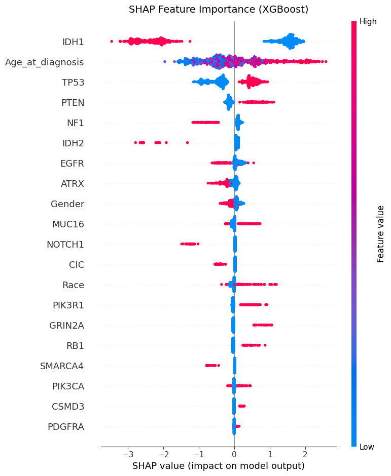

# Predicting Glioma Grade (LGG vs. GBM) Using Clinical & Mutation Features

This repository contains a machine learning pipeline designed to classify glioma brain tumors into **Lower-Grade Glioma (LGG, Class 0)** or **Glioblastoma (GBM, Class 1)** using patient clinical and genomic/mutation features. 

The project evaluates multiple modeling approaches, optimizes decision thresholds for clinical utility, calculates bootstrap confidence intervals for robust validation, and incorporates interpretability through SHAP and clinical decision curve analysis (DCA).

---

## Project Highlights
* **Robust Cross-Validation:** Uses a 5-fold Stratified Cross-Validation scheme to ensure generalization and guard against overfitting.
* **Optimized Decision Thresholds:** Instead of using a default threshold of 0.5, decision thresholds are dynamically tuned using the Precision-Recall curve to maximize the F1-score.
* **Model Benchmarking:** Evaluates five diverse models: Logistic Regression, Random Forest, XGBoost, LightGBM, and TabNet (deep learning for tabular data).
* **Interpretability & Utility:** Features SHAP (SHapley Additive exPlanations) for global and local feature importance alongside Decision Curve Analysis (DCA) to measure clinical net benefit.

---

## Dataset
The dataset utilized is the **TCGA Glioma Clinical and Mutation Features** dataset (`TCGA_InfoWithGrade.csv`), which consists of:
* **Total Samples (N):** 839 (after dropping missing targets)
  * **LGG (Class 0):** 487 samples
  * **GBM (Class 1):** 352 samples
* **Features:** 23 clinical and genomic mutation features. Categorical variables are converted via one-hot encoding, and missing values are imputed with 0.

---

## Experimental Setup & Models

1. **Logistic Regression:** Scaled using standard scaling; trained with L2 regularization (`max_iter=2000`).
2. **Random Forest:** Configured with 800 estimators, `max_depth=10`, and balanced class weights to handle minor class imbalances.
3. **XGBoost:** Gradient boosted trees optimized with `learning_rate=0.03`, `max_depth=4`, and L1/L2 regularization parameters.
4. **LightGBM:** Engineered for efficiency using 300 trees, 15 leaves, and a max depth of 4.
5. **TabNet:** A deep learning architecture tailored for tabular data, initialized with 64 decision steps (`n_d=n_a=64`), optimized using Adam (`lr=2e-3`), and trained with early stopping (patience of 20 epochs).

---

## Results & Performance Evaluation

All models were evaluated across 5 folds. The table below outlines the mean performance metrics obtained after optimizing the classification thresholds:

| Model | AUC | 95% AUC Confidence Interval | Accuracy | F1-Score | Precision | Recall | Brier Score | Best Threshold |
| :--- | :---: | :---: | :---: | :---: | :---: | :---: | :---: | :---: |
| **Random Forest** | 0.9226 | [0.9042, 0.9403] | 0.8725 | 0.8598 | 0.7981 | 0.9318 | 0.1008 | 0.4467 |
| **XGBoost** | 0.9183 | [0.8993, 0.9368] | 0.8689 | 0.8571 | 0.7895 | 0.9375 | 0.1073 | 0.2777 |
| **LightGBM** | 0.9171 | [0.8975, 0.9355] | 0.8594 | 0.8464 | 0.7813 | 0.9233 | 0.1067 | 0.3840 |
| **Logistic Regression**| 0.9169 | [0.8973, 0.9359] | 0.8737 | 0.8605 | 0.8015 | 0.9290 | 0.1034 | 0.4002 |
| **TabNet** | 0.9007 | [0.8783, 0.9208] | 0.8355 | 0.8244 | 0.7465 | 0.9205 | 0.1232 | 0.2888 |

---

## Visualizations

### Confusion Matrices
Below are the confusion matrices obtained using the optimized thresholds for each algorithm:

| Model | Confusion Matrix |
| :--- | :--- |
| **Logistic Regression** |  |
| **Random Forest** |  |
| **XGBoost** |  |
| **LightGBM** |  |
| **TabNet** |  |

---

### Explainable AI (SHAP Summary)
SHAP value analysis was executed using a `TreeExplainer` on the trained XGBoost model to understand individual feature impacts on grading predictions:



---

### Clinical Utility (Decision Curve Analysis - DCA)
Decision Curve Analysis was performed to evaluate the clinical net benefit of deploying these models compared to default strategies ("Treat All" or "Treat None").

| Full Decision Curve | Target Threshold Zoom |
| :---: | :---: |
|  |  |

---

## Getting Started

### Prerequisites
Install the required packages using pip:
```bash
pip install numpy pandas scikit-learn xgboost lightgbm pytorch-tabnet shap matplotlib seaborn

### Running the Pipeline
Place your dataset (`TCGA_InfoWithGrade.csv`) in the root directory and execute the main pipeline script:
bash
python glioma_grading.py

## Author
**[Kimia Janeshin]**
* GitHub: [@KimiaJaneshin](https://github.com/KimiaJaneshin)
* Email: [kimiajsh673000@gmail.com]

## License
This project is licensed under the [MIT License](LICENSE) - see the LICENSE file for details.

## Citation
If you use this code or findings in your research, please cite this repository:
```bibtex
@misc{Janeshin2026glioma,
  author = {Kimia Janeshin},
  title = {Predicting Glioma Grade (LGG vs. GBM) Using Clinical & Mutation Features},
  year = {2026},
  publisher = {GitHub},
  journal = {GitHub repository},
  howpublished = {\url{https://github.com/KimiaJaneshin/tcga-glioma-grading-ml}}}
